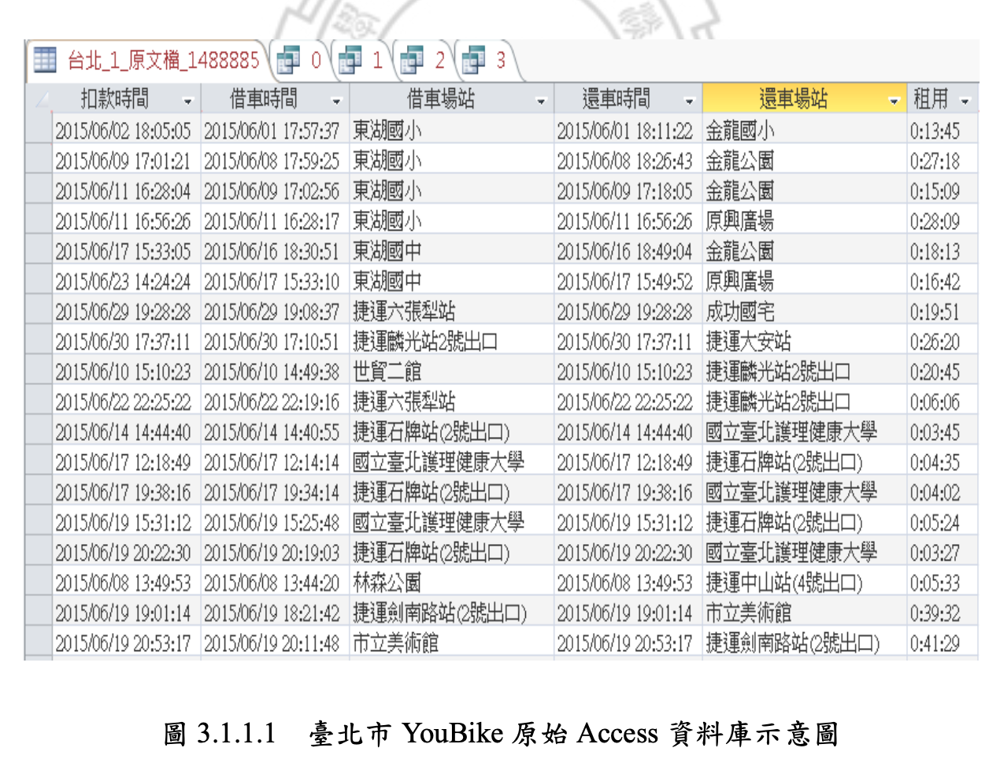
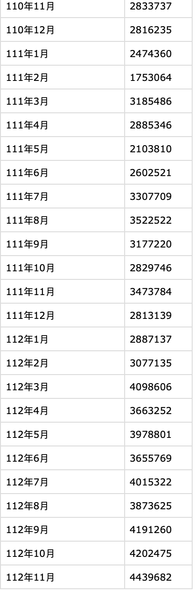
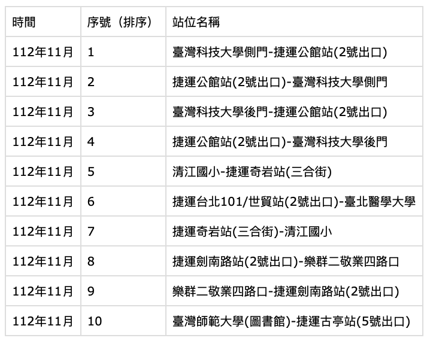
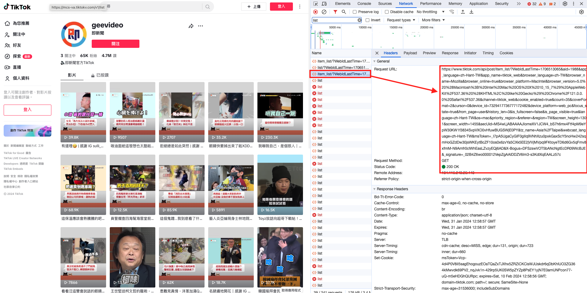
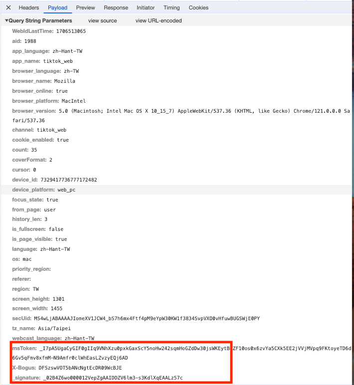
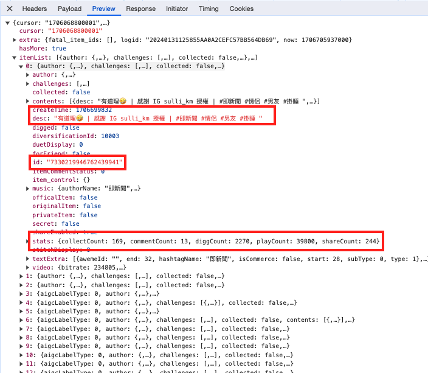
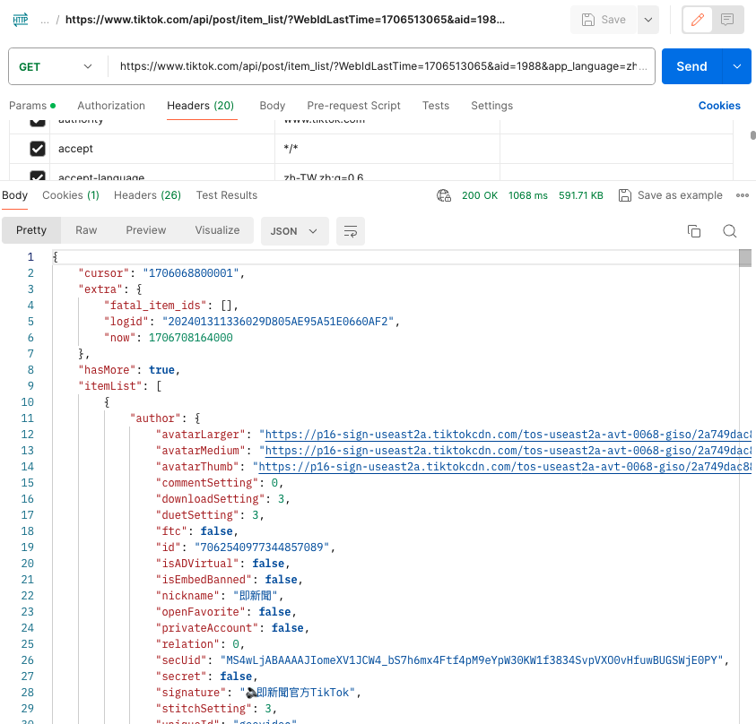
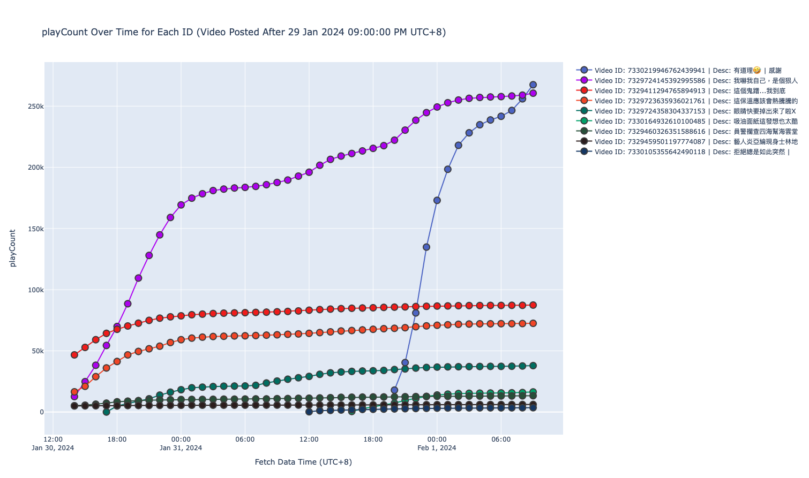

# Report of Pretest<!-- omit in toc -->

- [Problem 1](#problem-1)
- [Problem 2](#problem-2)
- [Problem 3](#problem-3)
  - [1st Step: Realize how TikTok fetch data for browser users](#1st-step-realize-how-tiktok-fetch-data-for-browser-users)
  - [2nd Step: Fetch data from Postman and use Python to mock the request process](#2nd-step-fetch-data-from-postman-and-use-python-to-mock-the-request-process)
  - [3rd Step: Try fetching in Jupyter Notebook and Compose a well-done script for crawling data](#3rd-step-try-fetching-in-jupyter-notebook-and-compose-a-well-done-script-for-crawling-data)
  - [4th Step: Put the script on server and Fetch data every hour](#4th-step-put-the-script-on-server-and-fetch-data-every-hour)
  - [5th Step: Pull data from crawling server and Visualize the data](#5th-step-pull-data-from-crawling-server-and-visualize-the-data)
  - [Drawback](#drawback)

# [Problem 1](#)

[探索資料能力] 若今日 Youbike 廠商提供2018年04 月的騎乘資料給我們，我們怎麼驗證對方提供的資料可能有漏？

---

使用官方相關過去報告 ｜ 確認是否數量級正確 ｜查看相關時間戳

---

對於官方提供的騎乘資料，應可能有以下幾種資料（以台北市為例）：

- 旅次資料：
    
    
    
    Src: [https://www.airitilibrary.com/Article/Detail/U0002-0102201822071000](https://www.airitilibrary.com/Article/Detail/U0002-0102201822071000)
    戴威(WEI TAI), 臺北市YouBike開放大數據為基礎的公共自行車旅次與租賃站特性分析, 2018
    
- 臺北市 YouBike2.0 租借數量前十路線:
    
    API Detail: [https://data.taipei/dataset/detail?id=2c2180b3-a7c8-4089-9182-7dc4aafbbe63](https://data.taipei/dataset/detail?id=2c2180b3-a7c8-4089-9182-7dc4aafbbe63)
    
    e.g.: 112 年 11 月開放資料
    
    
    
- YouBike 臺北市站位每月使用量：
    
    API Detail: [https://data.taipei/dataset/detail?id=d8cefb03-aba2-41ca-9996-d8774313cdc6](https://data.taipei/dataset/detail?id=d8cefb03-aba2-41ca-9996-d8774313cdc6)
    
    e.g.: 至 112 年 11 月開放資料
    
    
    
- YouBike 起訖站點統計：
    
    API Detail: [https://data.taipei/dataset/detail?id=c7dbdb7c-6bbd-495a-bd23-49b22defd83e](https://data.taipei/dataset/detail?id=c7dbdb7c-6bbd-495a-bd23-49b22defd83e)
    
    e.g.:  
    
    ```
    { 
        "type": "Feature", 
        "properties": { 
            "on_stop_id": "U101001", "off_stop_id": "U101001", "on_stop": "捷運科技大樓站", "off_stop": "捷運科技大樓站", "sum_of_txn_times": 139, "district_origin": "大安區", "district_destination": "大安區", "width": 2.4153846153846157
        }, 
        "geometry": { 
                "type": "LineString", "coordinates": [
                    [ 121.5436, 25.02605 ],
                    [ 121.5436, 25.02605 ]
                ] 
        } 
    }
    ```
    

透過以上的資料，假如我們能夠透過 YouBike 公司拿取所有以上資訊。首先，應先確認該月份（2018 年 4 月）是否在相互的資料對比驗證下為正確的數值。例如透過**旅次資料**的整理，能夠自行整理出**租借數量前十路線**的資料，因而能夠比對資料的正確性。並且可以再透過**YouBike 起迄站點統計**判斷出站點與站點之間的數據是否相互符合。以上如果有任一在資料上不相互符合的情況下，代表可能產生**資料有漏**的情況發生。

此外，如該提供之資料並非僅僅單一一個月，而已一年甚至是數年，我們可以透過政府定期發布之專題、學者研究的相關資料，交互比對資料上的正確性，然這方法可能有些許漏洞，因如這些專題報告亦使用 YouBike 公司所提供之資料，可能導致雙方使用之資料和現實使用量比對都是存在錯誤，但是交互比對時卻能認為沒有錯誤存在。

# [Problem 2](#)

[估算] 有100萬則Facebook 粉絲頁 平均250字左右中文字貼文資料，不含留言細節，但包含貼文心情互動統計資料、發文時間資料、粉絲頁名稱、粉絲頁ID 等欄位，儲存他們需要多少儲存空間？如果有建立中文索引，又可能要多少儲存空間？

---

範例貼文爬蟲資料：

[test.json](./md/problem2/test.json)

- 貼文資料 （750 MB）
    
    250 字中文貼文資料無包含其他圖片及多媒體，如均以 UTF-8 編碼儲存，則 1 個中文字為 3 bytes，全部大約是 750 bytes，則 100 萬 * 750 bytes = 750 MB
    
- 貼文心情互動統計資料（440 MB）
    
    有 6 種表情（這邊爬下來後僅需紀錄 reaction_count-total_count, like, love, haha, wow, sad, angry），整理過後如下 2 圖，約 440 bytes，則 100 萬 * 440 bytes = 440 MB
    
    ```python
    "reaction_count": {
        "count": 193,
        "is_empty": false
    },
    "top_reactions": {
        "count": 5,
        "edges": [{
            "visible_in_bling_bar": true,
            "node": {
                "id": "1635855486666999",
                "localized_name": "\u8b9a"
            },
            "i18n_reaction_count": "183",
            "reaction_count": 183
        }, {
            "visible_in_bling_bar": false,
            "node": {
                "id": "1678524932434102",
                "localized_name": "\u5927\u5fc3"
            },
            "i18n_reaction_count": "7",
            "reaction_count": 7
        }, {
            "visible_in_bling_bar": false,
            "node": {
                "id": "115940658764963",
                "localized_name": "\u54c8"
            },
            "i18n_reaction_count": "1",
            "reaction_count": 1
        }, {
            "visible_in_bling_bar": false,
            "node": {
                "id": "478547315650144",
                "localized_name": "\u54c7"
            },
            "i18n_reaction_count": "1",
            "reaction_count": 1
        }, {
            "visible_in_bling_bar": false,
            "node": {
                "id": "908563459236466",
                "localized_name": "\u55da"
            },
            "i18n_reaction_count": "1",
            "reaction_count": 1
        }]
    },
    ```
    
    ```python
    "reaction_count": {
        "count": 193,
    },
    "top_reactions": {
        "count": 6,
        "edges": [{
            "type": like
            "reaction_count": 182
        },{
            "type": love
            "reaction_count": 7
        }, {
            "type": haha
            "reaction_count": 1
        }, {
            "type": wow
            "reaction_count": 1
        }, {
            "type": sad
            "reaction_count": 1
        }, {
            "type": angry
            "reaction_count": 7
        }]
    },
    ```
    
- 發文時間資料、粉絲專頁名稱（平均以 10 個中文字）、粉絲頁 ID （140 MB）
    
    一篇貼文約 110 bytes，則 100 萬 * 140 bytes  = 140 MB
    
    ```python
    {
    	"post_id": 935519747935609,
    	"create_time": 1705861421,
    	"user_id": 100044327774911,
    	"name": "\u786c\u8981\u807d\u897f\u6d0b\u97f3\u6a02",
    }
    ```
    

全部空間所需約為：750 MB + 440 MB + 140 MB = 1.33 GB

---

而如需建立索引，則這裡考慮使用 B+tree：

1 則貼文所需空間約為 1.33 GB / 1,000,000 = 1.33 KB

假設 1 page 可以紀錄的大小為 16 KB，在 B+tree 上 leaf node 一頁約可以紀錄 12 筆資料，而總需 84,000 頁。

假設這裡先考慮使用 post_id 作為 Primary key 為 BIG_INT 範圍，則長度為 8 B，而 B+tree 需額外使用 pointer 指引 leaf node 位置，使用 6 B 為 pointer 佔用空間，1 頁 為 16384 B，對於每個 pointer element （BIG_INT + POINTER）為 14 B，1 頁能夠儲存 1170 個指針。以二階 B+tree，能夠儲存 1170 * 12 = 18,720 筆資料。但我們資料為 1,000,000 筆，所以需要到 3 階 B+tree。

因此將第二階如同第一階一樣作為 pointer：對於二階裡面的每一頁能夠儲存 1170 * 12 = 18,720 筆，而一階能夠儲存 1170 個第二階指針，因此全部能夠儲存 1170 * 1170 * 12 = 16,426,800 筆資料，足夠我們儲存本次全部的資料。

因此在透過 B+tree 上所需要的空間約為 一階：16 KB + 二階：1170 * 16 KB + 三階（Leaf Node）1.33 GB = 16 KB + 18.7 MB + 1.33 GB = 1.348716 GB，索引佔用的空間約為 0.0148716 GB，相比 1.33 GB 的資料量，大約為 1.11%。

而如使用中文索引，則我們預估為 2-3 倍的使用量，因此估計 1.11% * 2.5 = 2.75%，總使用量為 1.36 GB。

# [Problem 3](#)
[實作] [TikTok](https://www.tiktok.com/) 已經逐漸成為台灣指標的社群媒體之一，要請你不直接使用第三方爬蟲套件（ex.tiktok-scraper）的前提下，以python 實作tiktok 爬蟲。追蹤頻道 geevideo 資訊。內容包括：

    a. 持續追蹤三天頻道發布的貼文內容（若有新發文就擴增追蹤清單），並每1小時連續追蹤愛心數、留言數、收藏數、分享數三天的時間
    b. 最後成果，你需要告知監測哪三天時間。在Demo 時，請你用任何視覺化套件，將監測期間內各個互動指標的折線圖畫出來。

---
## [1st Step: Realize how TikTok fetch data for browser users](#)

- Request API:
    
    From searching the request in network tools, it is easy to found out that there is an API called `item_list`, which return the top 35 (by default) short videos from particular users.

     Pic. fetch_api.png

- Request Parameter:

    There are three parameters sent to the server in TikTok to verify whether the request is valid or not.

    Three parameters: `msToken`, `X-Bogus`, `_signature`

    These three parameters are corresponsive to other parameters. Hence we cannot just change other parameters and send the request, which will lead to no response. Therefore, to send customized parameters, we need to recalculate the three parameters.

    However, due to the limit of time, I cannot directly calculate them by them self though I might already find a tutorial [^1] to re-calculate them.

    Therefore, I tried to get the response first through Postman, which will be explain in later paragraph.

    [^1]: [抖音各加密参数说明和获取 (csdn)](https://blog.csdn.net/u013444182/article/details/134933150), [最新版tiktok网页版X-bougs和_signature (csdn)](https://jqiu1.blog.csdn.net/article/details/121525888?spm=1001.2014.3001.5502)

     Pic. fetch_param.png

- Response
    
    From the picture below, we could find out that in this API: There is a array list called `itemList`, which contains the top 35 short videos returned from the TikTok server. 

    Inside each item, there are some attributes: `createTime` - the time when author created in EPOCH format, `desc` - the description of the short video, `id` - the unique ID assigned to each short video, `stas` - the statistics of collect, share, play, digg(like), and comment of one short video.

    These are the data that fetched from the TikTok server we want to store for later visualization.

     Pic. fetch_response.png

## [2nd Step: Fetch data from Postman and use Python to mock the request process](#)

Since I decided not to recalculate the hash key of parameters and headers, I just copy the fetch url and all headers into Postman and make the user-agent remain as equal as the setting of browser to pretend the request is sent from a browser not from a crawler script.

 Pic. postman.png

From the above picture, we get the same response from the TikTok server. Therefore, I suggest that we could reuse the API, header, and parameters to consistently fetch data of GeeVideo from TikTok server.

## [3rd Step: Try fetching in Jupyter Notebook and Compose a well-done script for crawling data](#)

Inside `crawl.ipynb`, I have made some try to fetch the data, print them out, and export as a csv file.

In `crawl.py`, this is a better version for all process. There are three functions in this file: `crawlStats(startTimeStamp)`, `listStats(shortMediaItems)`, `cleanData(shortMediaItems)`, `exportCSV(processedItems)`. It need to work with `const.py`, where it stores the `startTimeStamp`, `base_url`, `params`, `headers` for `crawl.py`.

- `crawlStats(startTimeStamp)`
    
  Inside this function, it will use the API stored in `const.py` to get the short media item object list for videos created after the `startTimeStamp`. It will return the all short media item object list.

- `listStats(shortMediaItems)`

  Inside this function, it will list some data of 1 video per items.

- `cleanData(shortMediaItems)`
  
  Inside this function, it will clean the short media item list for return only data we wants: `id`, `createTime`, `collectTime`, `commentCount`, `diggCount`, `playCount`, `shareCount`, `desc`.

- `exportCSV(processedItems)`
  
  Inside this function, it will export the processed short media item lists as CSV file while the file name would be the timestamp of fetching time for visualization.

## [4th Step: Put the script on server and Fetch data every hour](#)

I use Raspberry Pi 3 Model B+ as the server, which use linux as its OS.

In order to make the crawling process as a routine job, I write a bash script for it and store the output as log into `log/{date-time}.log`. 

To make it routine, I use `crontab` to schedule the job. By typiong `crontab -e`, entering the editor to add a new routine job. Job is scheduled as below.

```bash
# m h  dom mon dow   command
0 * * * * bash /home/huangweichen/qsearch/run.sh
```

Then, restart `crontab` to activate the job. Hence, now, I have the data and log from TikTok server for every hour. 

The file tree as below:

    qsearch
    ├── run.sh
    ├── const.py
    ├── crawl.py
    ├── log
    |   ├── t1.log
    |   ├── t2.log
    |   ...
    |
    └── data
		├── t1.csv
		├── t2.csv
        ...

## [5th Step: Pull data from crawling server and Visualize the data](#)

Because my Raspberry was connected to the router using port forwarding and currently the port 80 and 443 is closed and not setting port forwarding on the router, also I cannot access the router for these days. Hence, I need to pull all data back to my computer to visualize them into graph.

To visualize them, first I need to process the date across all timestamp I fetched from the TikTok server. I iteratively read in all data and stored into 1 dataframe, while I add a column called `fetchDataTime` according to the file name named as time string. The final example of dataframe is as below.

| fetchDataTime | id | createTime | collectCount | commentCount | diggCount | playCount | shareCount | desc |
| ---: | ---: | ---: | ---: | ---: | ---: | ---: | ---: | ---: |
|2024-01-30 02:48:06|732972414-5392995586|1706572800|11|6|266|16900|14| 這個鬼蹭...我到底看了什麼 #即新聞 #小偷

Also, in the function `loadDataFrame(folderPath)`, I have calculated the delta of each statistics by the line `combinedDf['delta_{type_Count}'] = combinedDf.groupby('id')['{type_Count}'].diff().fillna(0).astype(int)`.

Furthermore, I add a color column to assign a RGB value for each unique ID. Therefore, when late plotting figures, the same ID would have the same color for better visualization.

Secondly, I visualized the data by the third party module of [plotly](https://plotly.com), which is a powerful plot tool that could also generate web interactive file for user to examine the statistics.

For the plotting process, I add trace (line) for each unique id across different timestamp and adjust the hover information for better viewing.

For the final step, I export all the four graph to one single html file and ask browser to display it. Below is a screenshot of part of the graphs.


Pic. example_graph.png

An example of full graph could be access [here](https://rawcdn.githack.com/900202eric/qsearch_pretest/96f85d3c47481e2b90cfc0c84b67ba2f9e07f800/problem3/p_graph.html).

## [Drawback](#)

- Crawling Process
  
  The current way might face some problems:
  - TikTok server block regular fetch ip, we could use **proxy ip** to bypass it.
  - TikTok server block the current hash key, then we need to get the parameters again manually from normal browser. Or we calculate the value by ourself, which cost a lot.
  
- Visualization
  - Raspberry Pi cannot directly output the graph. The solution could be using other kind of server, e.g.: Amazon EC2. or setting up the relative port.
